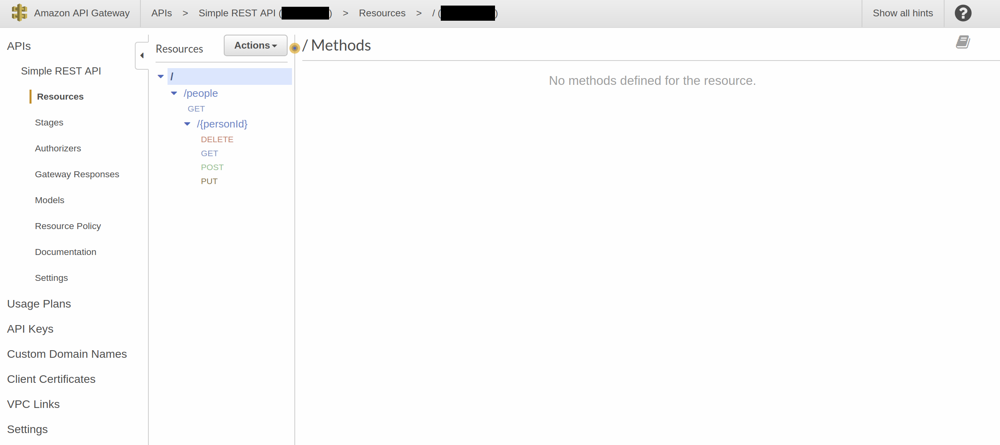
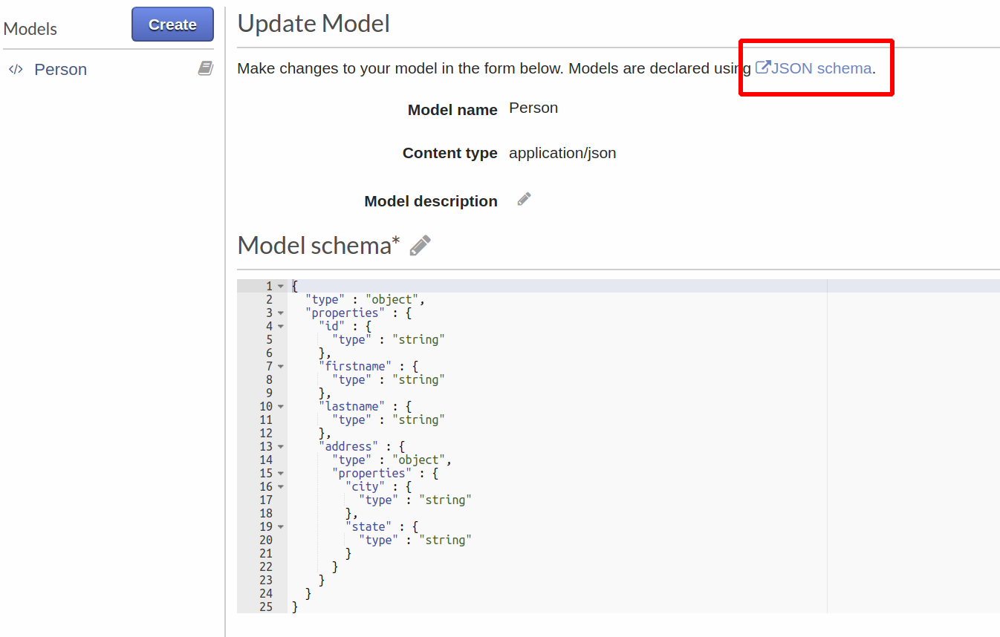
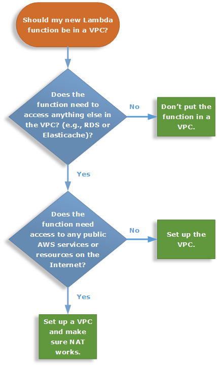

# API Gateways

 

Getting started with API Gateways (AWS first)

## Contents

The contents are as follows.

* [Motivation](#motivation)
* [AWS](#aws)
    * [Protocol](#protocol)
    * [Endpoint Type](#endpoint-type)
* [Swagger](#swagger)
* [Testing](#testing)
* [X-Ray](#x-ray)
* [Synchronous](#synchronous)
* [Networking](#networking)
* [Pricing](#pricing)
* [Reference](#reference)
    * [AWS API Gateway](#aws-api-gateway)
    * [JSON Schema](#json-schema)
    * [WebSockets](#websockets)
    * [Postman](#postman)
* [To Do](#to-do)

## Motivation

Following the [Single responsibility principle](http://en.wikipedia.org/wiki/Single_responsibility_principle)
(the __S__ in SOLID) and likewise [Separation of concerns (SoC)](http://en.wikipedia.org/wiki/Separation_of_concerns),
decoupling application logic from plumbing is probably a serverless ___best practice___.

API gateways can be used for:

* Filtering input data based on request and response mapping models
* Decoupling authorization and authentication from business logic
* Traffic throttling and rate limiting
* DDOS protection

From:

    http://docs.aws.amazon.com/lambda/latest/dg/with-on-demand-https.html

> Amazon API Gateway also adds a layer between your application users and your app logic that enables the following:
>
> * Ability to throttle individual users or requests.
>
> * Protect against Distributed Denial of Service attacks.
>
> * Provide a caching layer to cache response from your Lambda function.

## AWS

Starting with AWS, the steps are:

1. Sign up for [AWS](http://aws.amazon.com/)
2. Create an [IAM Administrator](http://docs.aws.amazon.com/IAM/latest/UserGuide/getting-started_create-admin-group.html)

[This is probably overkill for startups and smaller organizations, however the key takeaway of NOT using the __root__ account for everyday work applies.]

Once you have created a __non-root__ user account you should sign out and sign back in again (and AWS may even force you to do this).

#### Protocol

API Gateway supports REST APIs and [WebSocket APIs](#websockets).

#### Endpoint Type

Endpoints can be [edge-optimized, regional, or private](http://docs.aws.amazon.com/apigateway/latest/developerguide/api-gateway-api-endpoint-types.html).

The default is __Regional__, which is fine for development or a proof of concept.

Private endpoints require VPCs.

## Swagger

In AWS it is possible to import a Swagger definition:

[Here I imported the [Swagger definition](swagger.json) from my [Simple REST API](http://github.com/mramshaw/Simple-REST-API) repo.]

Swagger uses the [OpenAPI Specification](http://swagger.io/specification/) while the API Gateway uses [JSON Schema](#json-schema).

These two specifications overlap to a great deal but are not fully compatible.

The Swagger website has a useful page which describes the differences between the OpenAPI Specification and JSON Schema:

    http://swagger.io/docs/specification/data-models/keywords/

> OpenAPI 3.0 uses an extended subset of [JSON Schema Specification](http://json-schema.org/) Wright Draft 00 (aka Draft 5)
> to describe the data formats. “Extended subset” means that some keywords are supported and
> some are not, some keywords have slightly different usage than in JSON Schema, and additional
> keywords are introduced.

__TL;DR__ Swagger can be a useful shortcut to get up and running but is probably not suitable for the definitive statement
of an API for API Gateway purposes.

## Testing

Once everything has been defined it should be simple to test with either [Postman](#postman) or `swagger-ui`.

For RESTful APIs it should also be straightforward to test with `curl` or `httpie`.

However the API Gateway also provides good testing tools (and these are probably the place to start).

It's really a personal preference which testing tools to use.

## X-Ray

In order to gain some visibility into API Gateway networking, it is simple to activate
[AWS X-Ray](http://docs.aws.amazon.com/xray/latest/devguide/aws-xray.html).

[Sampling rules can be set for X-Ray to avoid the costs associated with sampling every invocation.]

## Synchronous

Lambda functions are great for glue code in many circumstances. They have multiple uses.

It may not be clear from __node.js__ examples, so it's worth remembering that the API Gateway
invokes Lambda functions ___synchronously___:

    http://docs.aws.amazon.com/lambda/latest/dg/lambda-services.html

In line with their many uses, Lambda functions can be invoked synchronously __and__ asynchronously;
this may well affect how they need to be coded (in terms of retries, etc). If they are triggered via
the API Gateway, then they will be blocking calls.

If they are __only__ invoked via the API Gateway then there is no requirement for queues (DLQs,
etc).

## Networking

The general recommendation is to NOT use VPCs:

> Don't put your Lambda function in a VPC unless you have to

Both the flowchart and the quote are from:

    http://docs.aws.amazon.com/lambda/latest/dg/best-practices.html#lambda-vpc

As the article states, VPCs add an extra layer of configuration. They will not help with cold starts
nor will they reduce network latency (in fact they can be expected to make both worse). Also, they
require Elastic Network Interfaces (or ENIs) for almost every cold start - and ENIs are not free.
VPCS will also complicate scaling. They may be needed in rare situations but otherwise deliver
little benefit.

## Pricing

Amazon API Gateway pricing:

    http://aws.amazon.com/api-gateway/pricing/

> The API Gateway free tier includes one million API calls, one million messages, and 750,000 connection
> minutes per month for up to 12 months.

## Reference

Some useful links follow.

#### AWS API Gateway

Amazon API Gateway Documentation

    http://docs.aws.amazon.com/apigateway/index.html

API Gateway Mapping Template and Access Logging Variable Reference

    http://docs.aws.amazon.com/apigateway/latest/developerguide/api-gateway-mapping-template-reference.html

#### JSON Schema

API Gateway models are defined with JSON Schema:

    http://json-schema.org/

Understanding JSON Schema:

    http://json-schema.org/understanding-json-schema/index.html

#### WebSockets

About WebSocket APIs in API Gateway

    http://docs.aws.amazon.com/apigateway/latest/developerguide/apigateway-websocket-api-overview.html

[WebSockets are not thought to be a good fit for serverless functions, which are stateless.]

#### Postman

Call an API with API Gateway Lambda Authorizers

    http://docs.aws.amazon.com/apigateway/latest/developerguide/call-api-with-api-gateway-lambda-authorization.html

[The article shows how to use [Postman](http://www.getpostman.com/) to test an API Gateway API.]

## To Do

- [x] Test with predefined Swagger
- [x] Investigate if VPCs are a good fit for serverless
- [x] Investigate if it is possible to export Swagger for a defined API Gateway
- [x] Investigate AWS X-Ray
- [ ] Test with WebSockets
- [ ] More testing
