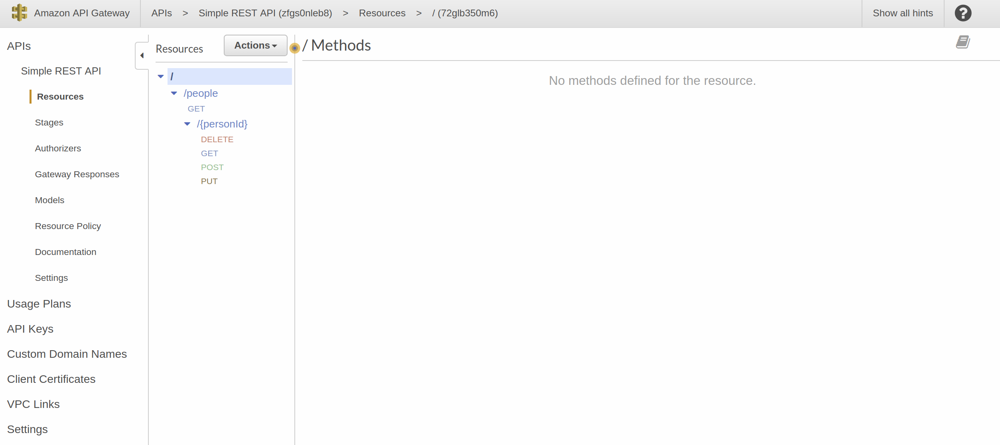

# API Gateways

 

Getting started with API Gateways (AWS first)

## Motivation

Following the [Single responsibility principle](http://en.wikipedia.org/wiki/Single_responsibility_principle)
(the __S__ in SOLID) and likewise [Separation of concerns (SoC)](http://en.wikipedia.org/wiki/Separation_of_concerns),
decoupling application logic from plumbing is probably a serverless ___best practice___.

API gateways can be used for:

* Filtering input data based on request and response mapping models
* Decoupling authorization and authentication from business logic
* Traffic throttling and rate limiting
* DDOS protection

## AWS

Starting with AWS, the steps are:

1. Sign up for [AWS](http://aws.amazon.com/)
2. Create an [IAM Administrator](http://docs.aws.amazon.com/IAM/latest/UserGuide/getting-started_create-admin-group.html)

## Swagger

In AWS it is possible to import a Swagger definition:

[Here I imported the Swagger definition from my [Simple REST API](http://github.com/mramshaw/Simple-REST-API) repo.]

## Testing

Once everything has been defined it should be simple to test with either `Postman` or `swagger-ui`.

For RESTful APIs it should also be straightforward to test with `curl` or `httpie`.

However the API Gateway also provides good testing tools (and these are probably the place to start).

It's really a personal preference which testing tools to use.

## Reference

Some useful links follow.

#### AWS API Gateway

Amazon API Gateway Documentation

    http://docs.aws.amazon.com/apigateway/index.html

## To Do

- [x] Test with predefined Swagger
- [ ] Investigate if it is possible to export Swagger for a defined API Gateway
- [ ] More testing
